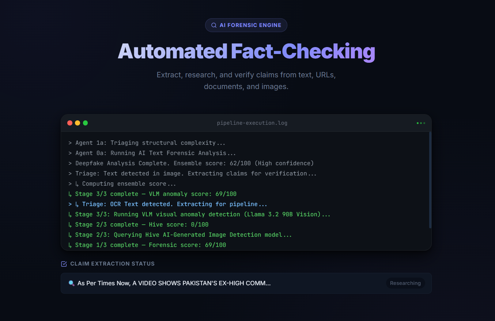
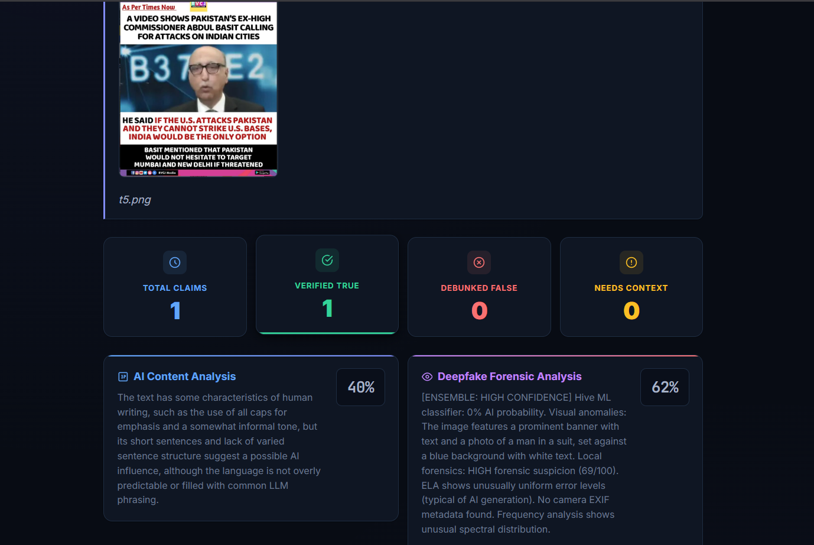
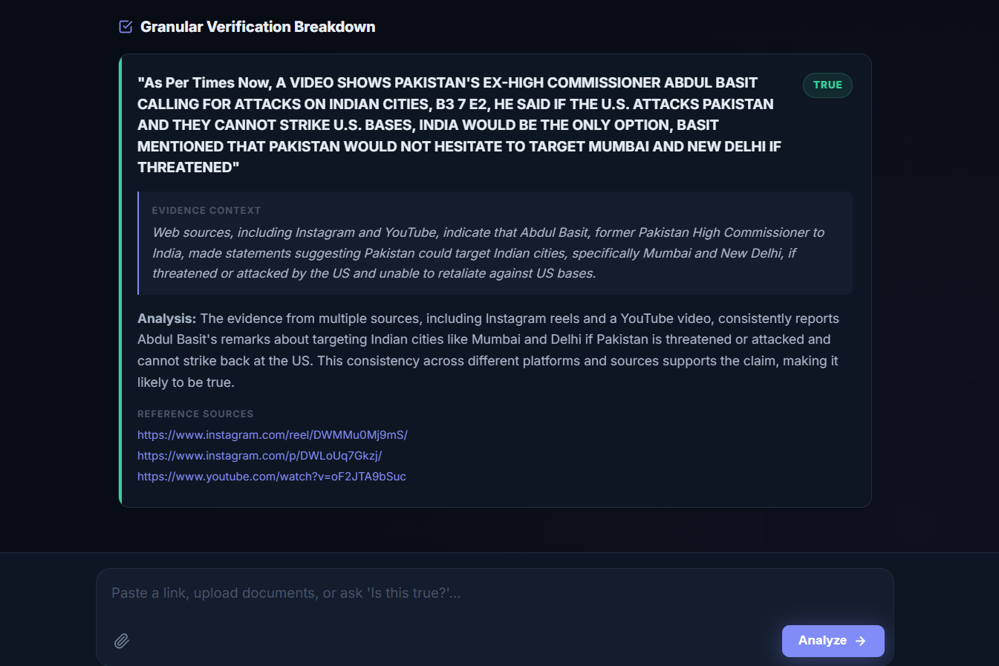

# 🔍 Automated Fact-Checking & Deepfake Analysis Engine

An advanced, multi-agent AI pipeline designed to verify claims, debunk misinformation, and detect synthetic media across omni-channel inputs. Whether you provide raw text, a web article, a PDF document, or a screenshot of a social media post, this engine autonomously parses the content, extracts verifiable claims, runs mathematical forensics, and provides a cited, granular accuracy report.

## ✨ Key Features

* **Omni-Input Processing:** Seamlessly accepts raw text, URLs, Documents (PDF/DOCX), and Images (Photographs, Memes, Chat Screenshots).
* **3-Stage Deepfake Forensic Pipeline:**
    * **Stage 1 (Local Forensics):** Uses deterministic mathematical analysis (Error Level Analysis, Fast Fourier Transform, and EXIF metadata extraction) to find synthetic pixel anomalies.
    * **Stage 2 (Hive ML):** Queries NVIDIA NIM's Hive AI-Generated Image classifier for deepfake probability scoring.
    * **Stage 3 (VLM Vision & OCR):** Utilizes Llama 3.2 90B Vision to act as a semantic triage agent, detecting UI elements, evaluating digital stylization, and performing highly accurate Optical Character Recognition (OCR).
* **Multi-Agent Verification Architecture:** Uses a swarm of specialized Llama 3.3 70B agents (Router, Extractor, Researcher, Judge) to break down complex narratives into atomic claims, research them against live web data, and deliver impartial verdicts.
* **AI Text Detection:** Analyzes the linguistic patterns (burstiness, perplexity) of extracted text to determine the probability of LLM generation.
* **Production-Ready UI:** Features a Live Agent Terminal with Server-Sent Events (SSE) streaming, Dark/Light mode toggles, and interactive pipeline breakdowns.
* **Enterprise-Grade Exporting:** * **Standalone Interactive HTML:** Export a self-contained, air-gapped `.html` report containing all CSS, JS, and embedded Base64 documents. Opens in any browser as a fully interactive dashboard with clickable document previews—no internet or backend required.
    * **True Vector PDF Export:** Utilizes native browser print engines to generate high-resolution, text-selectable, vector-based forensic PDFs.
    * **CSV Data Export:** Instantly download a spreadsheet of all claims, verdicts, confidence scores, and citation links.
* **Resilient API Handling:** Built with "Graceful Degradation" and "Safety Catchers" to automatically handle API timeouts, formatting hallucinations, and strict VLM privacy guardrails without crashing the user experience.

---

## 🧠 The Robust Pipeline Architecture

1.  **Phase 1: Pre-Processing & Omni-Parsing**
    * URLs are scraped and cleaned using `BeautifulSoup`.
    * Documents are parsed using `LlamaCloud API` for high-fidelity markdown extraction.
2.  **Phase 2: Deepfake & Media Analysis**
    * Images are routed through the 3-Stage Ensemble. If the Vision model detects a "screenshot" (like a WhatsApp chat or News Graphic), it intelligently bypasses the mathematical forensics (to prevent false alarms on UI text) and performs OCR to pass the text down to the fact-checker.
3.  **Phase 3: AI Text Forensics**
    * Extracted text is analyzed for synthetic generation markers.
4.  **Phase 4: Fact-Checking Swarm**
    * **Triage Agent:** Determines if the text is a single headline or a complex multi-claim paragraph.
    * **Extractor Agent:** Decomposes paragraphs into atomic claims, resolves pronouns, binds contextual entities (Time/Location), and strips out conversational filler.
    * **Researcher Agent:** Queries the Tavily API to gather top-tier web evidence.
    * **Judge Agent:** Impartially evaluates the claim against the evidence, assigning a verdict (True, False, Partially True, Unverifiable), a confidence score, and explicit URL citations.

---

## 📸 Demo: Social Media Post Analysis

The engine is highly capable of evaluating complex, multi-modal inputs like social media graphics containing both imagery and text.

**1. Omni-Input Ingestion:**
The user uploads a screenshot of a viral news graphic. The system instantly begins processing it through the Live Agent Terminal.
<br>


**2. Deepfake Analysis & OCR:**
The pipeline evaluates the image. It successfully extracts the embedded text via OCR while simultaneously running the 3-stage deepfake analysis on the visual components.
<br>


**3. Granular Fact-Checking:**
The extracted OCR text is broken down into verifiable claims. The Researcher Agent queries the web, and the Judge Agent delivers a cited verdict based on real-world news sources. 
<br>


---

## 🛠️ Project Setup Guide

### Prerequisites
* Python 3.10+
* API Keys for NVIDIA NIM, LlamaCloud, and Tavily.

### 1. Clone the Repository
```bash
git clone https://github.com/sharad0x/Fact-Claim-Verification-System.git
cd Fact-Claim-Verification-System
```

### 2. Install Dependencies
Make sure you have Pillow and numpy installed for the local forensic math engine to function correctly.
```bash
pip install -r requirements.txt
```

### 3. Configure Environment Variables
Create a .env file in the root directory and add your API keys.
- NIM_API_KEY: Required for Llama 3.3 70B (Text Agents), Llama 3.2 90B (Vision Agent), and the Hive ML Classifier. Get it from [NVIDIA build](https://build.nvidia.com/).
- LLAMA_CLOUD_API_KEY: Required for parsing PDFs and complex documents. Get it from [LlamaIndex](https://cloud.llamaindex.ai/).
- TAVILY_API_KEY: Required for the Researcher Agent to fetch live web data. Get it from [Tavily](https://www.tavily.com/).

.env Example:
```
NIM_API_KEY="nvapi-your-nim-key-here"
TAVILY_API_KEY="tvly-your-tavily-key-here"
LLAMA_CLOUD_API_KEY="llx-your-llama-cloud-key-here"
```

### 4. Run the Application
Launch the Flask server.
```
python app.py
```
Navigate to http://localhost:5000 in your browser to access the interface.